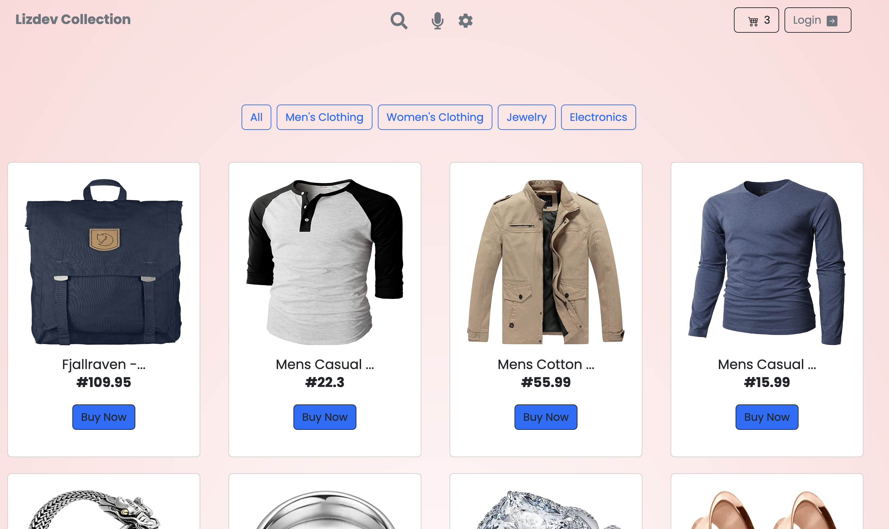

<a name="readme-top">Lizdev-Collection</a>

<br />
<div align="center">
  <a href="https://github.com/Lizdev-05/lizdev-collection">
    
  </a>
<br/>

# 📗 Table of Contents

- [📖 About the Project](#about-project)
  - [🛠 Built With](#built-with)
    - [Tech Stack](#tech-stack)
    - [Key Features](#key-features)
  - [🚀 Live Demo](#live-demo)
- [💻 Getting Started](#getting-started)
  - [Setup](#setup)
  - [Prerequisites](#prerequisites)
  - [Install](#install)
  - [Usage](#usage)
  - [Run tests](#run-tests)
  - [Deployment](#triangular_flag_on_post-deployment)
- [👥 Authors](#authors)
- [🔭 Future Features](#future-features)
- [🤝 Contributing](#contributing)
- [⭐️ Show your support](#support)
- [🙏 Acknowledgements](#acknowledgements)
- [📝 License](#license)

# 📖 Crown Store <a name="about-project"></a>

**Lizdev Collection** is a full-stack e-commerce web application built with React, Redux, and Paystack. It is a fully functional e-commerce website that allows users to browse products, add products to cart, and checkout. It also allows users to make payments using Paystack.

## 🛠 Built With <a name="built-with"></a>

### Tech Stack <a name="tech-stack"></a>

**Main Technologies:**

- 
- 
- 

### Key Features <a name="key-features"></a>

- **It allows users to browse products.**
- **It allows users to add products to cart.**
- **It allows users to add products to cart.**
- **It allows users to checkout their order.**
- **It allows users to make payment with paystack.**
- **Users can create a plan and also subscribe.**

<p align="right">(<a href="#readme-top">back to top</a>)</p>

## 🚀 Live Demo <a name="live-demo"></a>

- [Live Demo Link](Coming soon)

<p align="right">(<a href="#readme-top">back to top</a>)</p>

## 💻 Getting Started <a name="getting-started"></a>

To get a local copy up and running, follow these steps.

### Prerequisites

In order to run this project you need:

- Node environment to run it locally.

### Clone-Locally

- Enter this url: [https://github.com/Lizdev-05/lizdev-collection](https://github.com/Lizdev-05/lizdev-collection) in your web browser.
- Once opened navigate to the top left level of the project a green code download button will be visible on the righthand side.
- Select download Zip option from drop down menu.
- Once the download is complete you will be able to access my project locally .

### Install

Install this project with:

```sh
  cd lizdev-collection
  yarn install
```

### Usage

To run the project, execute the following command:

```sh
  yarn start
```

### Run tests

To run tests, run the following command:

```sh
  yarn test
```

### Deployment

You can deploy this project using:

```sh
  git push origin main
```

<p align="right">(<a href="#readme-top">back to top</a>)</p>

## 👥 Authors <a name="authors"></a>

👤 **Ojesanmi Elizabeth Oyin**

[](https://www.linkedin.com/in/elizabeth-oyinlade-ojesanmi-0702aa16a)
[](https://twitter.com/ojesanmi_oyin)
[](https://github.com/Lizdev-05)
[](https://hashnode.com/@Lizdev)
[](mailto:ojesanmioyinlade@gmail.com)

<p align="right">(<a href="#readme-top">back to top</a>)</p>

## 🔭 Future Features <a name="future-features"></a>

- [ ] **Allows sign-up and log-in options.**
- [ ] **Design backend with Node.js.**

<p align="right">(<a href="#readme-top">back to top</a>)</p>

## 🤝 Contributing <a name="contributing"></a>

Contributions, issues, and feature requests are welcome!

Feel free to check the [issues page](../../issues/).

<p align="right">(<a href="#readme-top">back to top</a>)</p>

## ⭐️ Show your support <a name="support"></a>

If you like this project please give it a ⭐️!

<p align="right">(<a href="#readme-top">back to top</a>)</p>

## 🙏 Acknowledgments <a name="acknowledgements"></a>

I would like to thank [Microverse](https://www.microverse.org/)for giving me the opportunity to learn and grow as a developer.
Also, I would like to appreciate [Alvative](https://alvative.com/) for this take home assignment which has enabled me to learn more.

<p align="right">(<a href="#readme-top">back to top</a>)</p>

## 📝 License <a name="license"></a>

This project is [MIT](./LICENSE) licensed.

<p align="right">(<a href="#readme-top">back to top</a>)</p>
